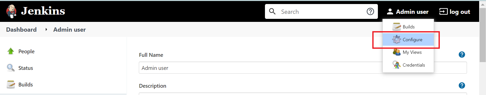
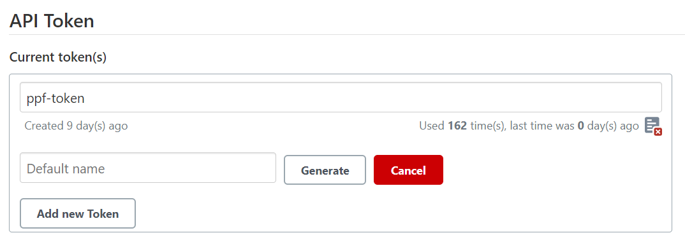

# Setup Jenkins on local machine

## Pre-reqs

### Generate PiPod token
1. Login to the piPod
2. From menu Click on `RBAC` and select `Token Management`
3. Provide Name and expiry and select `create`.
4. Copy the token and keep it safe.

### AWS setup
PiPOD stores Terraform state files in AWS S3. One time steps are as follows

#### Setup AWS Credentials for pipod provider backend
1. Go to Jenkins -> Manage Jenkins -> Manage Credentials
2. Go to  Store "Jenkins"
3. Go to Global credentials (unrestricted)
4. Go to "Add Credentials"
5. In Kind select "AWS Credentials"
6. Enter ID as "PIPOD_ACCOUNT_AWS" 
7. Enter Access Key ID
8. Enter Secret Access Key
9. Save Changes 

#### Setup S3 Bucket in AWS Account
1. Create S3 Bucket in AWS account to store the tfstate files 
2. In Amazon S3 console go to "Buckets" >> Create bucket  
3. Bucket Name Should be "pipodbucket02"
4. Region :- "us-east-2"
5. Turn off Block Public access checkbox
6. Create Bucket 

## Run jenkins locally as docker container

Go to ppf_support_tools repo and build jenkins image
```
docker build -t ppf_jenkins:1.0 .
```

Create docker volume
```
docker volume create vol_jenkins
```

Run jenkins container
```
docker container run -d -p 8080:8080 -v vol_jenkins:/var/jenkins_home --name ppf_jenkins ppf_jenkins:1.0
```

Check if jenkins container is running and get container id
```
docker ps
```

Get initial admin password
```
docker container exec ppf_jenkins sh -c "cat /var/jenkins_home/secrets/initialAdminPassword"
```

Go to http://localhost:8080
login with admin credentials got with InitialAdminPassword

Install recommended plugins

You may encounter following error while installing plugins
```
Exception in thread "main" javax.net.ssl.SSLHandshakeException: sun.security.validator.ValidatorException: PKIX path building failed: sun.security.provider.certpath.SunCertPathBuilderException: unable to find valid certification path to requested target
    at com.sun.net.ssl.internal.ssl.Alerts.getSSLException(Alerts.java:174)
    at com.sun.net.ssl.internal.ssl.SSLSocketImpl.fatal(SSLSocketImpl.java:1731)
    at com.sun.net.ssl.internal.ssl.Handshaker.fatalSE(Handshaker.java:241)
    at com.sun.net.ssl.internal.ssl.Handshaker.fatalSE(Handshaker.java:235)
    at com.sun.net.ssl.internal.ssl.ClientHandshaker.serverCertificate(ClientHandshaker.java:1206)
    at com.sun.net.ssl.internal.ssl.ClientHandshaker.processMessage(ClientHandshaker.java:136)
    at com.sun.net.ssl.internal.ssl.Handshaker.processLoop(Handshaker.java:593)
    at com.sun.net.ssl.internal.ssl.Handshaker.process_record(Handshaker.java:529)
    ...
```
This is caused by PSL Zsclaer certificate not trusted by Jenkins. To fix this issue, add the Zscaler certificate to Jenkins JRE trust store as follows
```
keytool -alias cloudServicesRootCA -import -file "Zscaler.crt" -keystore "C:\Program Files\OpenJDK\jdk-11.0.17.8-hotspot\lib\security\cacerts"
```

Notes -
1. Obtain Zscaler.crt from PSL network team by opening a service desk ticket
2. keystore referes to the JRE with which Jenkins is configured to use

## Install plugins
Go to Jenkins portal -> manage Jenkins -> Manage Pluging
In Manager Plugin page click "Available" tab and Install following plugins.

1. Environment Injector Plugin
2. Azure Credentials
3. Pipeline
4. Pipeline Utility Steps
5. Cloudbees aws credentials Plugin 

Click on "Install without restart" and wait till installation gets completed.

## Configure API token
You should generate API token which is required to call Jenkins pipeline from PiPOD api server.

1. Go to Jenkins portal using your jenkins credentials
2. Click on the `Configure` option under your username


3. Go to `API Token`. Provide name as <unique_token_name> and select `Generate`. Copy the new token and keep it safe.



## Create Jenkins job
1. Go to Jenkins-> New Item
2. Enter pipline name as `ppf-deploy-pipeline`
3. Select "Pipeline" in job
4. Click "Ok" to create.
  
## Configure Job
1. Go to Job -> Select Configure
2. In configuration page, under General, select checkbox "Prepare an environment for the run"
3. In Build Triggers, select "Trigger builds remotely (e.g., from scripts)". In token add the unique token generated above (see section Configure API token)
  
## Configure Job Pipeline
1. In Job Pipeline, select Defination "Pipeline Script from SCM"
2. In SCM, Select "Git"
3. In Repository URL, enter https://{yourGitToken}@github.com/PSLGRP/ppf_provisioning.git
4. In branch enter git <feature branch name> or `development` or `master`
5. In script path keep "Jenkinsfile"
  
## Setup ENV variable for API endpoint.
1. Go to Jenkins portal using admin credentials
2. Go to `Manage Jenkins -> Configure System -> Global Properties -> Environment Variables -> Add`
3. Add the ENV variable `PIPOD_API_ENDPOINT` and pass the Ip address or domain name of api endpoint.
4. Add the ENV variable `PIPOD_ACCOUNT_PROVIDER` and pass the pipod Provider `aws or azure`, to use in the backend configuration. 
5. Add the ENV variable `PIPOD_BUCKET` and pass the AWS backend bucket name, to use in the backend configuration
6. Add the ENV variable `PIPOD_REGION` and pass the AWS backend bucket region (for example : "us-east-1"), to use in the backend configuration
7. Add the ENV variable `PIPOD_TOKEN` and pass the token generated from piPod.

## Update ENV variables in PiPOD API
In order to submit requests to Jenkins pipeline, you need to update configurations in PiPOD API server
  
Open `ppf_api\.env` file
Update following properties
  
```
JENKINS_TOKEN_NAME=<token name created as per section `Configure API token`>
JENKINS_USER_NAME=<your jenkins user id>
JENKINS_USER_TOKEN=<token created as per section `Configure API token`>
JENKINS_URL=<url of the jenkins server>
JENKINS_JOB_NAME=ppf-deploy-pipeline
``` 

6. Restart API server
 
<hr>
** DEPERCATED **

# Shared Jenkins Server
A shared jenkins server is setup on AWS EC2 instance for all developers to use
http://67.202.34.229:8080/

The shared Jenkins server is used for 2 purposes
- If you are working on feature/story that involves changes to prov engine (Jenkins pipeline and scripts), you should setup your own pipeline and use that for dev and testing
- If you are working on UI and API and need to test end to end funcitonality, an existing stable master pipeline is to be used

If a new shared Jenkins server is setup, ensure following plugins are installed
```
Environment Injector Plugin
Azure Credentials
Pipeline
Pipeline Utility Steps
Cloudbees aws credentials Plugin 
```

### Login
Connect with Stuti Jain for your jenkins user id and password

Admin user credentials
```
ID - admin
Password - 3a612bfe2a234de484e5a9ddc79aadc7
```
### Expose local PiPOD API server
Jenkins job running on shared Jenkins server needs to communicate with PiPOD api server. As the local dev env is running on your workstation (localhost), Jenkins job cannot commmunicate with API server. We will use ngrok to expose local api server via secure tunnel for connectivity to Jenkins job

1. Signup download and install ngrok through https://ngrok.com/
2. Execute `ngrok http 3000 --host-header="localhost:3000"`
3. Copy the `Forwarding URL`. Forwarding URL is public hosting URL of the application

### Setup AWS Credentials for pipod provider backend
1. Go to Jenkins -> Manage Jenkins -> Manage Credentials
2. Go to  Store "Jenkins"
3. Go to Global credentials (unrestricted)
4. Go to "Add Credentials"
5. In Kind select "AWS Credentials"
6. Enter ID as "PIPOD_ACCOUNT_AWS" 
7. Enter Access Key ID
8. Enter Secret Access Key
9. Save Changes 

### Setup S3 Bucket in AWS Account
1. Create S3 Bucket in AWS account to store the tfstate files 
2. In Amazon S3 console go to "Buckets" >> Create bucket
3. Bucket Name - `pipodbucket02`
4. Region `us-east-2`
5. Turn off Block Public access checkbox
6. Create Bucket 
